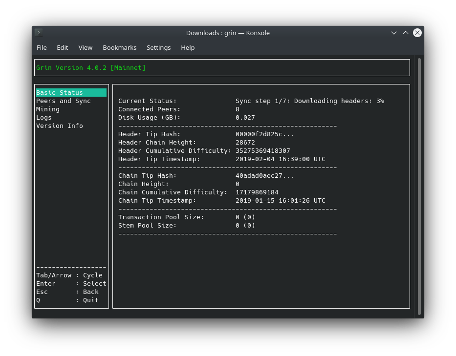

# Initializing Node and Wallet

## Running a Mugle Node

The rest of the documentation is common for Linux, macOS and Windows.

Running a Mugle node is as simple as typing the command:

```bash
mugle
```

You should see the following window:

Congratulations! 🎉 You are now running a Mugle full node.
The initial sync might take anywhere from 30 minutes to a few hours depending on your connection speed and CPU performance.

!!! tip ""
    If you have a good Internet connection, you can help strengthen the network by keeping your PC running with a mugle node and [port 6814 open](https://forum.mugle.org/t/how-to-open-port-6814-and-why/7825).

All data files will be created at the hidden folder `~/.mugle` (under your home directory). Inside this folder, of special interest is the file `mugle-server.toml` which can be used to modify configuration options.

## Creating a Mugle Wallet

While your node is syncing, let's initialize a new Mugle wallet.

In the command prompt type the following:

```bash
mugle-wallet init
```

Your wallet will now ask you to create a password. Most wallet commands will require it, so you'll be typing the password quite often.
In order to hide it, your keyboard input will not be displayed.

```text
Please enter a password for your new wallet
Password:
Confirm Password:
```

Next, the wallet will show your recovery-phrase:

```text
Your recovery phrase is:

fire execute festival romance just void lecture leopard balcony trick waste castle undo master custom ordinary million slam wise oil whisper mechanic episode room
```

This phrase is a list of 24 words which encode all the information needed to recover your wallet. If your computer breaks or your hard drive becomes corrupted, you can enter `mugle-wallet init -r` and type the phrase to recover your mugles.

Store it safely, preferably in a non-digital format.
