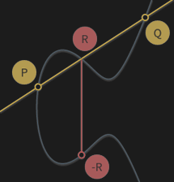
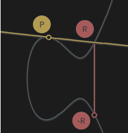

---
description: Elliptic Curve Cryptography ECC
---

**Preface**

The following three-part series is intended for those who wish to understand what goes on inside Mimblewimble and Mugle. We try to make this objective more accessible by going through the cryptographic primitives required to know first, without diving into proofs and specifics. Once those are in order, we connect everything and explain how Mimblewimble works.

1. [Elliptic Curves](ecc.md)
1. [Commitments](commitments.md)
1. [Mimblewimble](mimblewimble.md)

For the original introduction (along with many translations), refer to [here](https://github.com/mugleproject/mugle/blob/master/doc/intro.md).

---

# Elliptic Curve Cryptography

Mimblewimble relies entirely on Elliptic-curve cryptography (ECC), an approach to public-key cryptography. Put simply, given an algebraic curve of the form `y^2 = x^3 + ax + b`, pairs of private and public keys can be derived. Picking a private key and computing its corresponding public key is trivial, but the reverse operation `public key -> private key` is called the *discrete logarithm problem*, and is considered to be computationally infeasible.

Let's review the basics.

## Operations

These are the relevant mathematical operations we can do on Elliptic-curve points.

* Addition - Given two points, we can add them to one another (or subtract) and the result would be a new point on the curve.
* Multiplication - Given a point, we can multiply it any number of times.

#### Addition

Given three aligned points **P**, **Q** and **R**, their sum is always 0. We treat this as an inherent property of elliptic curves.

```text
P + Q + R = 0
```
We can then write it as:

```text
P + Q = -R
```

So that adding the two points P and Q results in -R, the inverse of R.

If we draw a line passing through P and Q, this line will cross a third point on the curve, R (so that P, Q and R are aligned). If we take the inverse of this point, which is simply the one symmetric to it about the x-axis, we have found the result of adding two curve points, P + Q. Let’s illustrate:

<center>
{ width=200 }
</center>

In other words, addition of points is basically hopping around on the curve to a different, seemingly random point; It looks random unless you know the exact operation performed to reach it.

#### Multiplication

We can’t multiply a point by another point, but we can multiply a point by a number (scalar). Multiplying point **P** by scalar `k` would simply require adding point **P** onto it self `k` times. This operation is easily demonstrated by assigning `k=2` so that `k*P = P+P`. To illustrate how it would look like on the curve, we draw a tangent line. You can imagine that the line intersects three points, whereas two of them are **P**, such that:

```text
P + P = -R
```

<center>
{ width=200 }
</center>


!!! note ""
    To calculate `8*P` for e.g. wouldn’t take 8 operations, but only 3; you can find `2*P`, then add it onto itself, and then add `4*P` onto itself, for the final result of `8*P`.

## Key Pairs

An ECC system defines a publicly known constant curve point called the generator point, **G**. The generator point is used to compute any public key. A key pair consists of:

* Private key **k** – A randomly chosen 256-bit integer (scalar).
* Public key **P** – An Elliptic-curve point derived by multiplying generator point G by the private key.

And more clearly, a public key (of private key `k`) is as follows:

```text
P = k*G
```

This is easy to compute.

But, if everybody knows points P and G, can they find out what `k` is? The answer is no; The difficulty of getting from one point to another is precisely the definition of the Elliptic curve discrete logarithm problem.

!!! note "Secp256k1"
    The specific Elliptic curve that Mugle employs is rust-secp256k1 (y^2^ = x^3^ + 7) using Schnorr signature scheme.


[^1]: [Elliptic Curve Cryptography: a gentle introduction](https://andrea.corbellini.name/2015/05/17/elliptic-curve-cryptography-a-gentle-introduction/)
[^2]: [A (Relatively Easy To Understand) Primer on Elliptic Curve Cryptography](https://blog.cloudflare.com/a-relatively-easy-to-understand-primer-on-elliptic-curve-cryptography/)
[^3]: [Cryptography: From Mathematical Magic to Secure Communication](https://www.youtube.com/watch?v=4M8_Oo7lpiA)
